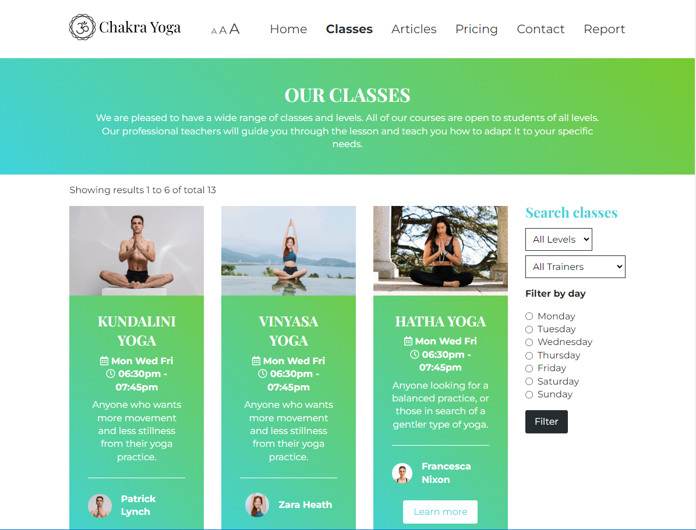
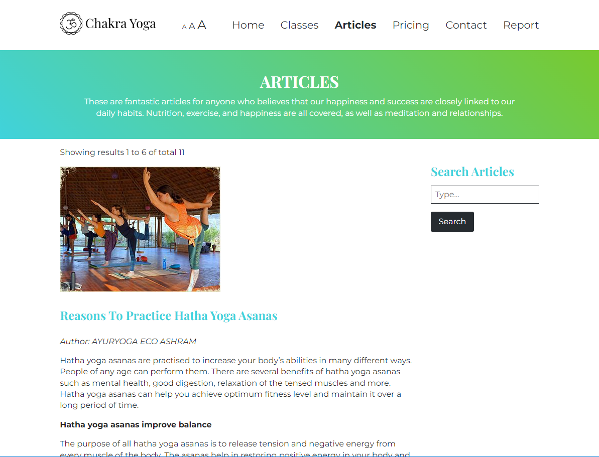

# Chakra Yoga Project Report

**Introduction:**

The main idea is to aware people about yoga and my website’s yoga instructors help you to expand your yoga practice, improve your headstands, and unwind for the day at Chakra Yoga Studio. Instructors combine a variety of classes and yoga variations to make you feel calm and energetic right away. Instructors remain committed to assisting beginners, intermediates and experts in maintaining a healthy and productive practice for the rest of their lives. We don't just teach yoga; we provide the whole package.

**Inspiration:**

1. First I get inspired from television yoga instructor - Swami Ramdev, an Indian yogi

2. https://www.ayuryoga-ashram.com

3. https://www.yogateket.com

**Accessibility:**

1. Visual Impairment: I have added font resizing “AAA” in the middle of the header.

2. Visual Impairment: On all the images there is “alt” text is present. It reads aloud to blind users on a screen reader.

3. This website keyboard friendly. We can use “tab” button to move next items, “Shift+Tab” to move previous item, “Enter” to activate the link.

**Usability:**

1. The website navigation is effortless and made much easy to go to topic of interest.

2. Even a person who don’t have much experience of internet and computer can use this website comfortably.

3. The website very much memorable for user to use easily in future.

4. This website can be accessed by Visually Impairment person.

**Learning:**

1. I have done lot of internet research to finalize wireframe design which is appealing.
2. To fix the bugs and to learn logic behind the code, I watched YouTube videos and read Stack overflow pages.
3. I used w3schools.com and developer.mozilla.org as a developer guidebook.

**Evaluation I:**

1. I think I have succeeded to do good wireframes because I did lot of internet research.
2. I have succeeded to develop website as per wireframe designed by me as I used w3schools.com and developer.mozilla.org as reference guide.
3. I have succeeded in getting knowledge to use comments effectively in HTML, CSS and JS because in mid-term project we discussed a lot about different aspects about website development among team members. Effective use of comments is one of the aspects discussed in the project.

**Evaluation II:**

1. I could be able to make website animated in future.
2. I learnt that there are lot of libraries which can be effetely used by me for web development.
3. I could be able to add videos in carousel.
4. I could be able to improve the UI of the website.

**Resources:**

1. Sources of information:

- Carousel quotes: https://positivepsychology.com/benefits-of-yoga
- Yoga positions: https://www.health.harvard.edu/exercise-and-fitness/yoga-balance-workout
- Classes: https://yogamedicine.com/guide-types-yoga-styles/
- Articles: https://www.ayuryoga-ashram.com/blog/
- Icons: https://www.flaticon.com
- Images: https://www.pexels.com/ , https://www.freepik.com
- Reference websites: https://www.w3schools.com, https://developer.mozilla.org/

2. Libraries:

- Glider.js
- Leaflet.js
- Fontawesome.js
- Handlebars.js
- Jquery.js
- Modernizr.js

3. Code:

- Navigation: https://codepen.io/erikterwan/pen/EVzeRP
- Carousel: https://www.youtube.com/watch?v=0wvrlOyGlq0
- Handlebars: https://stackoverflow.com/questions/12331077/does-handlebars-js-replace-newline-characters-with-br#:~:text=6%20Answers&text=By%20inserting%20three%20braces%20instead,by%20a%20%7B%7Bexpression%7D%7D%20.
- Pagination: https://www.youtube.com/watch?v=mslD-bpvjiU&t=113s
- Boilerplate: https://html5boilerplate.com/

4. Tools: Figma, Intillij IDEA, Adobe illustrator, Adobe photoshop, Open street map

**Appendices:**

1.  Mockups:

- mockup-home.png
- mockup-classes.png
- mockup-articles.png
- mockup-pricing.png

2. Wireframes:

- Desktop-Home.jpg
- Desktop-Classes.jpg
- Desktop-Article.jpg
- Desktop-Pricing.jpg
- Desktop-Contact.jpg
- Mobile-Home.jpg
- Mobile-Classes.jpg
- Mobile-Article.jpg
- Mobile-Pricing.jpg
- Mobile-Contact.jpg

3. Sitemap:

